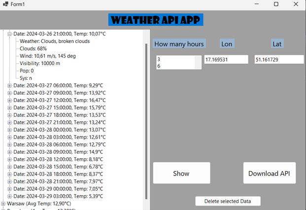

# WeatherDataApp Documentation

**Author:** Mateusz Ambroży

---

## 1. Introduction

The WeatherDataApp is a simple desktop application that allows users to view weather forecasts for selected locations.

## 2. Task Implementation

### I. Fetching and Deserializing Data from External API

Data was fetched from the OpenWeather API and deserialized using the `DeserializeObject<type>(string)` function into corresponding classes.

### II. Database Handling

Following the instructions, the following packages were used:
- `Microsoft.EntityFrameworkCore`
- `Microsoft.EntityFrameworkCore.Sqlite`
- `Microsoft.EntityFrameworkCore.Tools`

The classes used for deserialization were modified to be compatible with the database.

When adding the fetched data to the database, the data is checked to avoid duplicates; only unique data is added. Additionally, there is functionality to delete data from the database by selecting the relevant data in the TreeView interface and confirming the change with a button.

### III. Advanced GUI and Data Processing

The final user interface is as follows:

#### Data Filtering

To filter data fetched from the API, a list is provided with the option to select the number of hours ahead for which to fetch the weather. Users can select the city to check the weather by entering the longitude and latitude.

#### Data Display

Data is displayed using a TreeView, which calculates the average temperature for cities based on the data available in the database.
